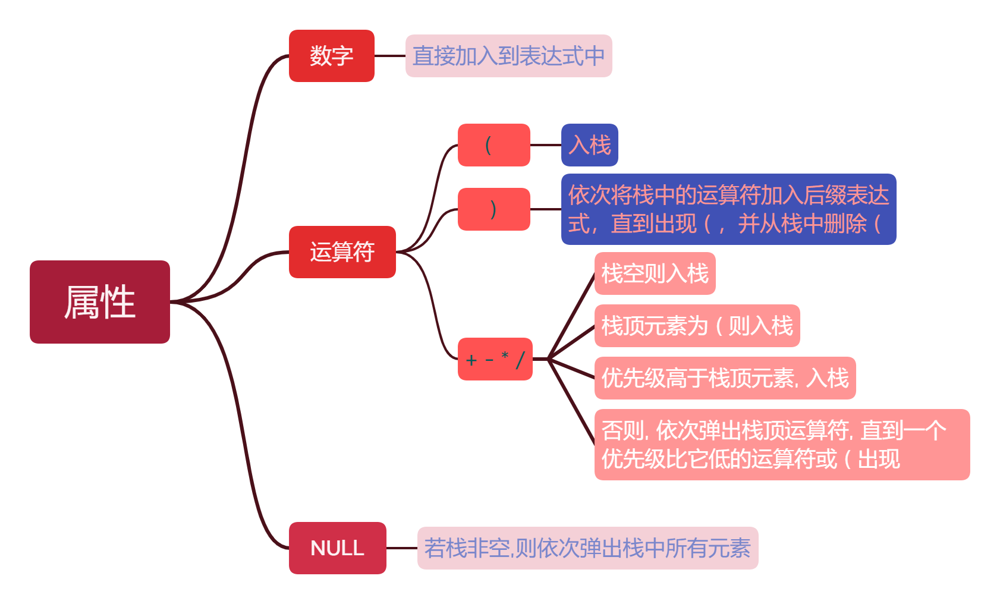

### 基于逆波兰式的四则运算计算器

利用栈实现的简易计算器,进行 + - * / () 的四则计算   

接收一个中缀表达式,先翻译为逆波兰式,再计算给出结果

##### 中缀表达式 → 后缀表达式

遍历中缀表达式, 根据当前元素的属性, 进行如下操作 

##### 计算后缀表达式

遇到数字就入栈; 遇到运算符, 则将栈顶第一和第二个运算出栈, 分别置于运算符的右边和左边, 将其运算结果入栈,继续遍历下面的元素. 最后留下的数字就是计算结果

